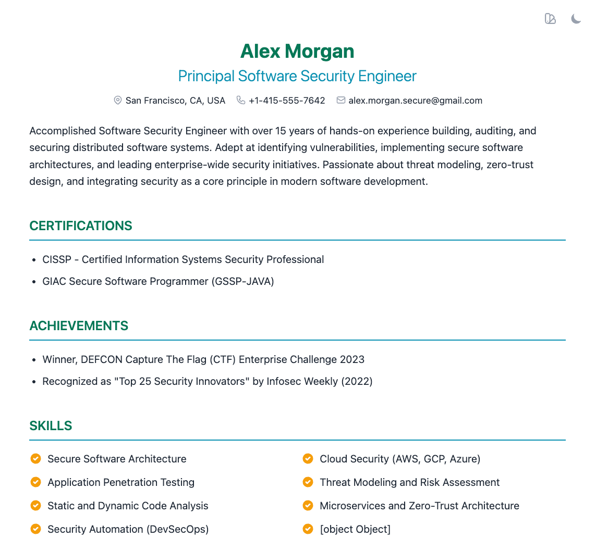
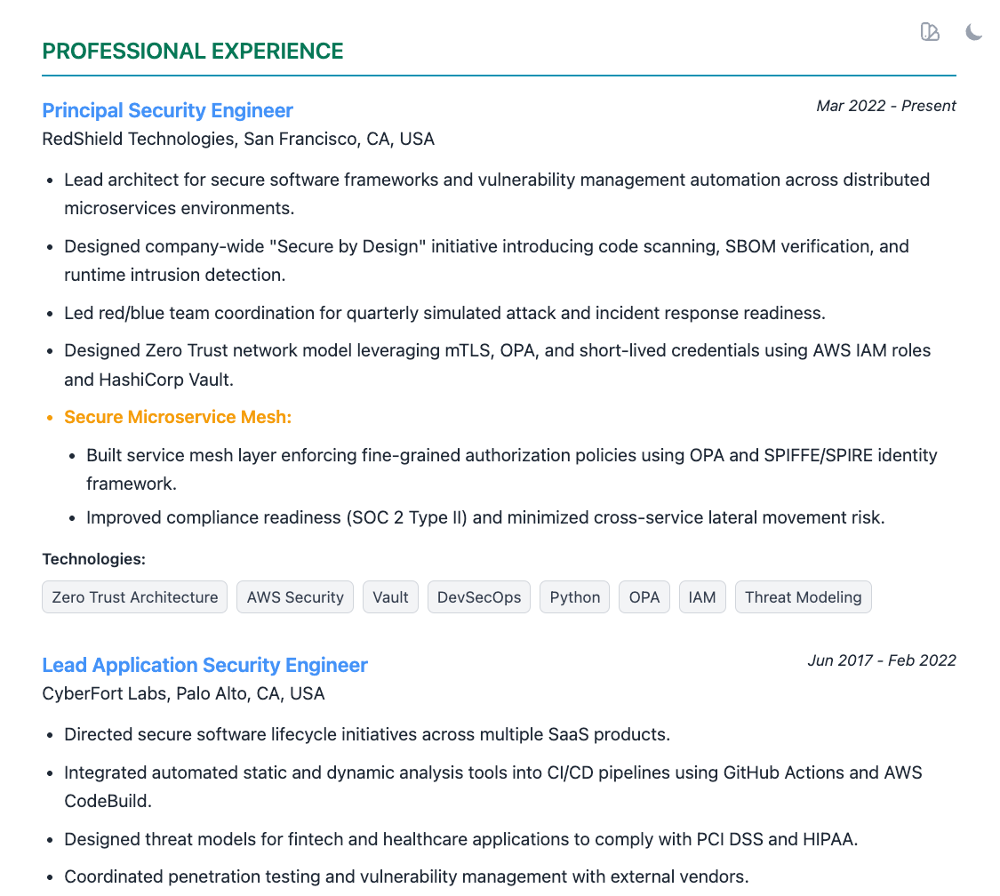

# 🚀 Modern Resume Generator from YAML to HTML

A modern, customizable HTML resume generator:

- Create beautiful, responsive resumes that look great on screen and in print.
- Built with Vite, Tailwind CSS, and Handlebars. 

<p align="center">


</p>

## Features

✨ **Modern Design**: Clean, professional layouts using Tailwind CSS
🎨 **Multiple Themes**: Switch between different color schemes in real-time with a single click
🌓 **Dark Mode**: Built-in light/dark mode toggle with localStorage persistence
📱 **Responsive**: Looks great on desktop, tablet, and mobile
🖨️ **Print-Ready**: Optimized for PDF export with configurable page breaks
⚡ **Fast Build**: Powered by Vite for lightning-fast development
📝 **Easy Content**: Update your resume via YAML or JSON files

## Quick Start

### Installation

```bash
# Install dependencies
pnpm install
```

### Development

```bash
# Generate your resume as a single HTML file
pnpm prebuild
```

This will:
1. Process your YAML/JSON resume data
2. Apply Tailwind CSS with PostCSS
3. Generate a single self-contained HTML file in `dist/index.html` (52 KB)
4. CSS and JavaScript are fully inlined - perfect for sharing!

Open `dist/index.html` in your browser to view your resume.

### Build for Production

```bash
# Generate optimized production build
pnpm build
```

This will:
1. Run `prebuild` to generate `dist/index.html`
2. Optimize with Vite (minification, extraction)
3. Output to `build/` directory with separate assets

Output structure:
- `build/index.html` (48 KB) - Optimized HTML with inlined CSS
- `build/assets/index-xyz.js` (4.3 KB) - Extracted and minified JavaScript

## Usage

### 1. Edit Your Resume

Copy resume-example.yaml to `resume.yaml` (or create `resume.json`) and edit
with your information:

```yaml
name: Your Name
title: Your Professional Title
contact:
  address: City, Country
  phone: +1-234-567-8900
  email: your.email@example.com
  linkedin: linkedin.com/in/yourprofile

objective: |
  Your professional objective or summary...

skills:
  - Skill 1
  - Skill 2
  - Skill 3

experience:
  - title: Job Title
    company: Company Name
    duration: Jan 2020 - Present
    responsibilities:
      - Achievement or responsibility
      - Another achievement
    pageBreakAfter: false  # Set to true to force page break after this entry

education:
  - degree: Degree Name
    institution: University Name
    duration: 2015 - 2019
    pageBreakAfter: false

interests:
  - title: Interest Name
    description: Description of your interest
```

### 2. Switch Themes

**In Browser (Real-time)**:
- Click the paint palette icon in the top-right corner
- Cycles through all available themes
- Theme preference is saved in localStorage

**Available themes**:
- professional-blue
- elegant-green
- modern-purple
- default-theme
- custom-theme.json

Note: All themes are embedded in the final generated HTML.

### 3. Create Custom Themes

Create or edit theme files in `themes/` directory. New themes are automatically detected and added to the theme switcher:

```json
{
  "name": "My Custom Theme",
  "fonts": {
    "heading": "Playfair Display",
    "body": "Inter"
  },
  "colors": {
    "primary": "#1e40af",
    "secondary": "#60a5fa",
    "tertiary": "#FCA47C",
    "accent": "#3b82f6",
    "text": {
      "light": "#1f2937",
      "dark": "#f3f4f6"
    },
    "background": {
      "light": "#ffffff",
      "dark": "#111827"
    },
    "muted": "#6b7280"
  },
  "spacing": {
    "sectionGap": "2rem",
    "itemGap": "1rem"
  }
}
```

### 4. Toggle Dark Mode

Click the sun/moon icon in the top-right corner to switch between light and dark modes. Your preference is saved automatically.

### 5. Control Page Breaks

For PDF export, control where pages break by setting `pageBreakAfter: true` in your resume data:

```yaml
experience:
  - title: Senior Developer
    company: Tech Corp
    duration: 2020 - Present
    responsibilities:
      - Built amazing things
    pageBreakAfter: true  # Forces a page break after this section
```

### 6. Deploy

Configure deployment settings:

```bash
# Set your remote server details
export DEPLOY_HOST=user@yourserver.com
export DEPLOY_PATH=/var/www/html/resume

# Uncomment the execSync line in deploy.js, then:
pnpm deploy
```

## Project Structure

```
resume-generator/
├── resume.yaml           # Your resume content (YAML)
├── resume.json           # Alternative: resume content (JSON)
├── prebuild.js           # Prebuild script (Handlebars + PostCSS + Tailwind)
├── deploy.js             # Deployment script (scp)
├── vite.config.js        # Vite configuration
├── tailwind.config.js    # Tailwind configuration
├── postcss.config.js     # PostCSS configuration
├── src/
│   ├── template.hbs      # Handlebars template
│   └── style.css         # Custom styles + Tailwind directives
├── themes/               # Theme configurations
│   ├── default-theme.json
│   ├── professional-blue.json
│   ├── elegant-green.json
│   └── modern-purple.json
├── dist/                 # Single HTML file (52 KB, fully self-contained)
│   └── index.html        # CSS & JS inlined - ready to share/email
└── build/                # Production build output (optimized)
    ├── index.html        # Optimized HTML with inlined CSS
    └── assets/
        └── index-xyz.js  # Extracted, minified JavaScript
```

## Commands

| Command | Description |
|---------|-------------|
| `pnpm prebuild` | Generate single self-contained HTML file in `dist/` |
| `pnpm build` | Build optimized production files in `build/` |
| `pnpm preview` | Preview production build locally |
| `pnpm deploy` | Build and deploy to remote server |

## Two Output Formats

**`dist/index.html`** (52 KB):
- Single self-contained HTML file
- CSS fully processed and inlined
- JavaScript inlined
- Perfect for: Email attachments, job portals, quick sharing
- Usage: `pnpm prebuild` then open `dist/index.html`

**`build/`** (48 KB HTML + 4.3 KB JS):
- Optimized production build
- CSS inlined, JavaScript extracted
- Minified and optimized by Vite
- Perfect for: Web hosting, CDN deployment
- Usage: `pnpm build` then deploy `build/` directory

## Exporting to PDF

### Browser Method (Recommended)

1. Run `pnpm prebuild` to generate `dist/index.html`
2. Open `dist/index.html` in your browser
3. Press `Ctrl+P` (Windows/Linux) or `Cmd+P` (Mac)
4. Choose "Save as PDF" as destination
5. Set margins to "Default" or "None"
6. Enable "Background graphics"
7. Save

### Tips for Best PDF Output

- Page breaks are controlled via `pageBreakAfter` in your resume input yaml.
- Colors and backgrounds are preserved
- Dark mode toggle is hidden in print
- Optimized for Letter size (8.5" × 11")

## Customization

### Change Fonts

Edit `src/style.css` to import different Google Fonts:

```css
@import url('https://fonts.googleapis.com/css2?family=YourFont:wght@300;400;600&display=swap');
```

Then update your theme's font configuration.

### Modify Layout

Edit `src/template.hbs` to change the HTML structure and Tailwind classes.

### Adjust Styles

Modify `src/style.css` for custom CSS or print styles.

## Troubleshooting

**Build fails**: Make sure you have Node.js 18+ and pnpm installed.

**Styles not applying**: Run `pnpm build` to regenerate with Tailwind processing.

**Page breaks not working**: Check that `pageBreakAfter: true` is set in YAML and you're viewing in a browser (not dev tools device mode).

## License

MIT

## Credits

Built with:
- [Vite](https://vitejs.dev/)
- [Tailwind CSS](https://tailwindcss.com/)
- [Handlebars](https://handlebarsjs.com/)
- [js-yaml](https://github.com/nodeca/js-yaml)
